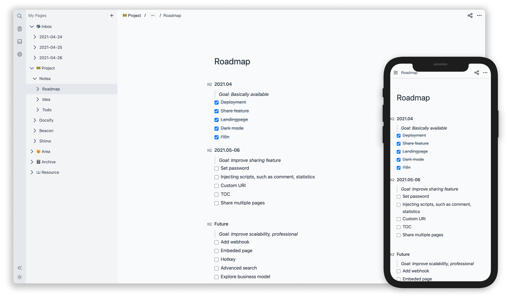

# Notea

> Self hosted note taking app stored on S3.



<a href="https://www.producthunt.com/posts/notea?utm_source=badge-featured&utm_medium=badge&utm_souce=badge-notea" target="_blank"></a>

## Features

- One-click deploy to Vercel/Netlify or deploy to host with Docker
- Support storage in Amazon S3, MinIO, Aliyun OSS, etc
- Notion like markdown editor

## Demo

- Link: https://notea.vercel.app

## Requirement

- [Next.js](https://nextjs.org/)
- [S3](https://docs.aws.amazon.com/AmazonS3/latest/userguide/Welcome.html)
- [Vercel](https://vercel.com/), [Netlify](netlify.com) or [Docker](https://www.docker.com/)

## Quickstart

1. Fork repo. It is recommended to install the **[ Pull app](https://github.com/apps/pull)** for automatic synchronization.
1. [Choose Storage](#storage) and **manually create bucket**.
1. [Deploy App](#deploy)

## Deploy

### Vercel(Recommended)

Click https://vercel.com/new to deploy your fork repo.

### Netlify

Click https://app.netlify.com/start to deploy your fork repo.

### Docker

```bash
docker run -d \
  --name notea \
  -p 3000:3000 \
  -e STORE_ACCESS_KEY=Q3AM3UQ867SPQQA43P2F \
  -e STORE_SECRET_KEY=zuf+tfteSlswRu7BJ86wekitnifILbZam1KYY3TG \
  -e STORE_BUCKET=notea \
  -e STORE_END_POINT=http://play.minio.io \
  -e STORE_FORCE_PATH_STYLE=true \
  -e PASSWORD=notea \
  cinwell/notea
```

You can use [watchtower](https://containrrr.dev/watchtower/) to keep the latest version.

```bash
docker run -d \
  -v /var/run/docker.sock:/var/run/docker.sock \
  containrrr/watchtower -c notea
```

If you are looking for MinIO + Notea docker configuration [check this](https://www.reddit.com/r/selfhosted/comments/n0jacf/notea_selfhosted_notetaking_app_stored_on_s3_aka/gw89iyo?utm_source=share&utm_medium=web2x&context=3)

## Storage

Configure environment variables according to storage service.

### MinIO

`.env`

```sh
STORE_ACCESS_KEY=
STORE_SECRET_KEY=
STORE_BUCKET=notea
STORE_END_POINT=http://localhost:9000
# Required
STORE_FORCE_PATH_STYLE=true
PASSWORD=
```

### Amazon S3

`.env`

```sh
STORE_ACCESS_KEY=
STORE_SECRET_KEY=
STORE_BUCKET=notea
STORE_REGION=us-east-1
PASSWORD=
```

### Aliyun OSS

`.env`

```sh
STORE_ACCESS_KEY=
STORE_SECRET_KEY=
STORE_BUCKET=notea
STORE_END_POINT=https://oss-cn-hangzhou.aliyuncs.com
STORE_REGION=oss-cn-hangzhou
PASSWORD=
```

### Tencent COS

`.env`

```sh
STORE_ACCESS_KEY=
STORE_SECRET_KEY=
STORE_BUCKET=notea # create the bucket first
STORE_END_POINT=https://cos.ap-guangzhou.myqcloud.com
STORE_REGION=ap-guangzhou
PASSWORD=
```

Other services that support the s3 protocol can also be used.
Contribution examples are welcome.

## Environment variables

| Name                   | Description                                                                                                                | Default   | Optional | Required |
| ---------------------- | -------------------------------------------------------------------------------------------------------------------------- | --------- | -------- | -------- |
| PASSWORD               | password to login to the app                                                                                               |           |          | true     |
| STORE_ACCESS_KEY       | accessKey                                                                                                                  |           |          | true     |
| STORE_SECRET_KEY       | secretKey                                                                                                                  |           |          | true     |
| STORE_BUCKET           | bucket                                                                                                                     |           |          | true     |
| STORE_END_POINT        | host name or an IP address.                                                                                                |           |          |          |
| STORE_REGION           | region                                                                                                                     | us-east-1 |          |          |
| STORE_FORCE_PATH_STYLE | Whether to force path style URLs for S3 objects                                                                            | false     |          |          |
| COOKIE_SECURE          | only works under https: scheme **If the website is not https, you may not be able to log in, you need to set it to false** | true      |          |          |
| BASE_URL               | The domain of the website, used for SEO                                                                                    |           |          |          |

## Development

```sh
cp .env.sample .env
docker-compose up -d
yarn dev
```

## LICENSE

MIT
